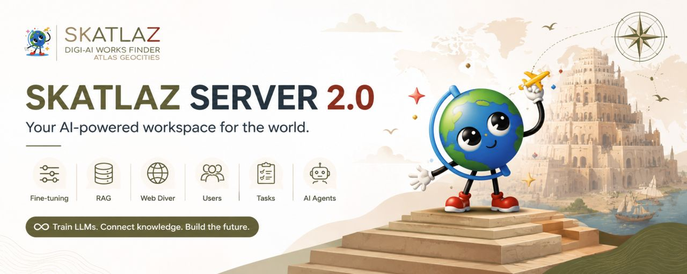

# 🚀 Skatlaz Server AI 2.0

> Enterprise AI Server Platform powered by Django, Ollama, RAG, MCP Servers and Generative AI.


---

# Overview

Skatlaz Server AI 2.0 is a complete Artificial Intelligence platform designed to build, deploy and manage AI-powered applications using local and cloud models.

The platform combines:

* Local LLMs through Ollama
* Google Gemini integration
* RAG (Retrieval-Augmented Generation)
* Fine-Tuning pipelines
* MCP Server Architecture
* Web Crawling and Data Collection
* Agent Orchestration
* Training Dataset Management
* Enterprise Administration Interface

The goal of Skatlaz Server AI is to provide organizations with a self-hosted AI infrastructure capable of operating completely offline or in hybrid environments.

---

# Main Features

## 🤖 AI Models

* Ollama Integration
* Google Gemini Integration
* Multiple LLM Providers
* Local Inference
* Cloud Inference
* Model Switching

---

## 📚 RAG System

* Document Collections
* Semantic Search
* Embeddings
* Knowledge Bases
* Context Retrieval
* Automatic Chunk Generation

Supported sources:

* PDF
* DOCX
* TXT
* CSV
* JSON
* XML
* RSS
* Websites

---

## 🌐 Web Intelligence

Integrated Web Search:

* DuckDuckGo Search
* WebDiver Crawling
* RSS Feed Processing
* Website Extraction
* Content Indexing

The platform automatically searches the web when no internal knowledge is found.

---

## 🧠 AI Agents

Create specialized agents for:

* Programming
* Customer Support
* Research
* Content Generation
* Data Analysis
* Documentation

---

## ⚙ MCP Server Architecture

MCP Servers provide modular AI capabilities.

Examples:

* Code Generation MCP
* Research MCP
* Music Producer MCP
* Entertainment MCP
* Documentation MCP
* Marketing MCP

---

## 🔬 Fine Tuning

Supports:

* LoRA
* QLoRA
* Dataset Preparation
* Model Export
* Ollama Export
* GGUF Conversion
* Safetensors Support

---

## 📊 Administration Dashboard

Manage:

* AI Agents
* Chat Sessions
* Prompt Templates
* RAG Collections
* Training Datasets
* Fine Tune Jobs
* MCP Servers
* Web Diver Tasks
* Generated Artifacts

---

# Architecture

```text
Users
  │
  ▼
Skatlaz Server AI
  │
  ├── AI Agents
  ├── MCP Servers
  ├── RAG Engine
  ├── Training Engine
  ├── Web Search Engine
  ├── WebDiver
  ├── Ollama
  ├── Gemini
  └── API Layer
```

---

# API Endpoints

## Ask AI

```http
GET /ask/?q=what+is+django
POST /ask/
```

Example:

```json
{
    "prompt": "What is Django?"
}
```

---

## Training

```http
POST /train/
```

Example:

```json
{
    "question": "What is Django?",
    "answer": "Django is a Python Web Framework."
}
```

---

## Search

```http
GET /search/?q=django
```

---

## Feeds

```http
GET /feeds/
```

---

# Installation

## Clone Repository

```bash
git clone https://github.com/skatlaz/skatlaz_server_ai.git
cd skatlaz_server_ai
```

## Create Virtual Environment

```bash
python -m venv venv
```

Windows:

```bash
venv\Scripts\activate
```

Linux:

```bash
source venv/bin/activate
```

---

## Install Dependencies

```bash
pip install -r requirements.txt
```

---

## Run Migrations

```bash
python manage.py migrate
```

---

## Create Administrator

```bash
python manage.py createsuperuser
```

---

## Start Server

```bash
python manage.py runserver
```

Open:

```text
http://127.0.0.1:8000/admin/
user:skatlaz_admin
pwd:skatlaz_123
python manage.py changepassword skatlaz_admin
```

---

# Technology Stack

* Python
* Django
* SQLite / PostgreSQL
* Ollama
* Google Gemini
* Sentence Transformers
* ChromaDB
* FAISS
* WebDiver
* DuckDuckGo Search

---

# Roadmap

## Version 2.x

* Advanced RAG
* Multi-Agent Workflows
* MCP Marketplace
* Ollama Model Management
* AI Analytics

## Version 3.0

* DeepSeek Code Integration
* Autonomous Software Engineering
* Katlaz++ Integration
* Android Support
* iOS Support
* Visual AI Workflow Builder

---

License

Skatlaz Server AI 2.0 is an Open Source and Freeware project developed by Skatlaz.

You are free to:

Use
Study
Modify
Extend
Distribute

according to the license included in this repository.

The goal of this project is to provide a complete Artificial Intelligence Server Platform for developers, researchers, students, businesses and technology enthusiasts.

Developed By

Skatlaz Digi-AI Office

Website:

https://skatlaz.com

Contact:

https://skatlaz.com/en/contact/

Project Author

Igor Felix

CTO & AI Software Engineer

Creator of:

Skatlaz Server AI
Katlaz++
Katlaz App
Buskplay Platform
Quick Installation

Clone repository:

git clone https://github.com/skatlaz/skatlaz_server_ai.git
cd skatlaz_server_ai

Create virtual environment:

python -m venv venv

Windows:

venv\Scripts\activate

Linux/macOS:

source venv/bin/activate

Install requirements:

pip install -r requirements.txt

Run database migrations:

python manage.py migrate

Create administrator account:

python manage.py createsuperuser

Recommended administrator:

Username: skatlaz

Start server:

python manage.py runserver

Open:

http://127.0.0.1:8000/admin/
Default API Examples

Ask AI:

http://127.0.0.1:8000/ask/?q=what+is+django

Search Knowledge Base:

http://127.0.0.1:8000/search/?q=python

Feeds:

http://127.0.0.1:8000/feeds/
Vision

Building an open, extensible and self-hosted AI ecosystem powered by:

Django
Ollama
Gemini
MCP Servers
RAG Systems
Web Intelligence
Katlaz++ Technologies

for developers around the world.

© Skatlaz Digi-AI Office

---

# About Skatlaz

Skatlaz develops Artificial Intelligence, Software Engineering and Enterprise Automation solutions.

Products:

* Skatlaz Server AI
* Katlaz++
* Buskplay Platform
* AI-DSP Press

Website:

[https://skatlaz.com](https://skatlaz.com)

© Skatlaz Digi-AI Office. All rights reserved.

Esse formato fica bem profissional para GitHub, GitLab e apresentação comercial do Skatlaz Server AI 2.0.
